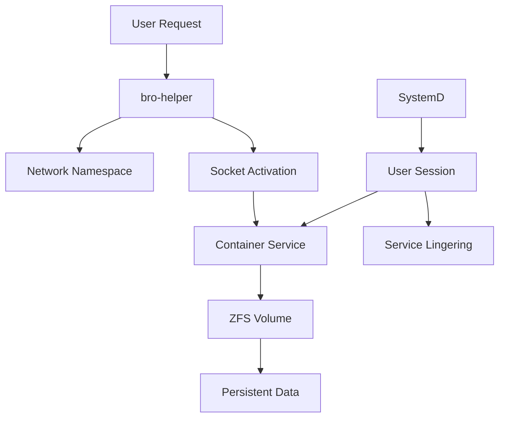

# Components Overview

Brothaman consists of several key components that work together to provide secure, manageable containerized services.

## Core Components

### Runtime & Execution
- **[Network Helper](../specifications/bro-helper.md)** - Network namespace management and socket activation
- **[Container Runtime](../unprivileged-podman.md)** - Rootless Podman configuration and management
- **[User Management](../user-scope.md)** - User session and service scope management

### Storage & Persistence  
- **[ZFS Backend](../zfs.md)** - Advanced storage features with snapshots and delegation
- **[User Sessions](../users-and-lingering.md)** - SystemD user session management

## Component Interactions

## Security Model

All components operate under the principle of least privilege:
- Containers run as unprivileged users
- ZFS operations use delegated permissions  
- Network access is carefully controlled
- SystemD manages service lifecycles
