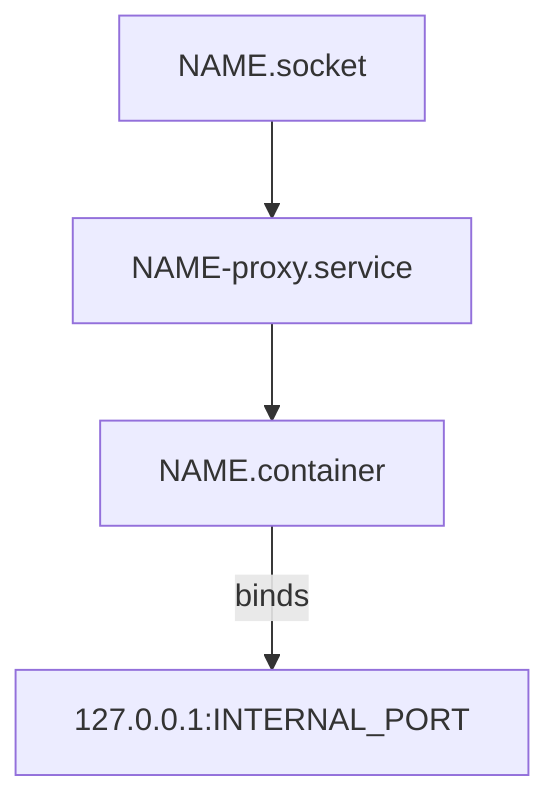

# Per-Service Pattern Diagram

This diagram illustrates the per-service pattern used in Brothaman for socket-activated container services.

## Service Pattern Components

- **NAME.socket**: Socket unit that defines the listening address and port
- **NAME-proxy.service**: Proxy service using systemd-socket-proxyd
- **NAME.container**: Quadlet container descriptor
- **127.0.0.1:INTERNAL_PORT**: Container's internal service port

## Pattern Benefits

This standardized pattern provides:

### Socket Activation
- Services start automatically when clients connect
- Zero resource usage when idle
- Fast startup times for lightweight containers

### Security Isolation  
- Containers bind only to localhost
- External access controlled through systemd socket units
- No direct container port exposure

### Systemd Integration
- Full lifecycle management
- Logging integration via journald
- Service dependencies and ordering
- Resource limits and controls

### Scalability
- Each service follows the same pattern
- Easy to replicate for new services
- Consistent configuration across services

## Implementation Example

For a service named `myapp`:
- `myapp.socket` - listens on external port (e.g., 8080)
- `myapp-proxy.service` - forwards to localhost:3000
- `myapp.container` - runs container with internal port 3000