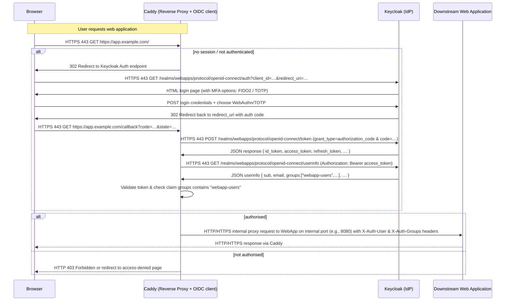

# Real World Example

This is a good point to consider a real world (concrete) example to solidify our understanding of the concepts covered so far.

In this lab we will explore a system of applications that use the same shared database while running a very dangerous application, the pgAdmin application used for PostgreSQL database management. We will demonstrate how to mitigate the inherent risks of pgAdmin in a containerized environment using Podman quadlets and systemd.

## 0. Snapshot

Before proceeding, create a VM snapshot to allow easy rollback after completing this lab. You can create a snapshot with the following command on your host:

```bash
vagrant snapshot save example-start
```

## 1. pgAdmin

pgAdmin is a popular tool for managing PostgreSQL servers and databases. It provides a web-based interface for database administration tasks such as creating databases, running queries, managing users, and monitoring performance. It manages connection objects to PostgreSQL servers and databases, storing connection parameters and credentials (sometimes of database super users) within its own internal database. By its very nature it is an extremely dangerous application to host and to expose.

>**WARNING**: Enterprise production environments should never use pgAdmin or similar database management applications. They are simply too risky to expose and they promote one-off manual changes to database servers outside of DevOps automation processes making database servers snowflake servers. Such tools are a security nightmare and should be avoided at all costs in almost all environments much less production environments. Non-production developer environments, and perhaps home lab environments for those just learning to us Postgresql, I understand, but still I recommend against it. It's a crutch, just start getting used to using SQL, DDL, and DevOps automation instead: the investment amortizes in the end and you won't instill bad habits in yourself.

### 1.1 Get triggered

Anytime you see an application that:

* exposes a web interfaces for management
* manages connections and credentials
* has access to super user credentials
* has the ability to run arbitrary commands
* is always on and accessible over the network

You should be immediately triggered to avoid using it at all costs. Such applications are a magnet for attackers and a security nightmare to manage. We're only toying with the idea as a challenging exercise to demonstrate how to mitigate the risks of such an application using Podman quadlets and systemd. Do not take this as an endorsement to use pgAdmin or similar classes of risky applications in your environments.

When you do get triggered, and you don't have a choice (because higher authorities insists on using such an abomination of an application), then the protection patterns discussed here will help. In fact, these techniques are still recommended for any third party applications you cannot thoroughly assess the security implications of. They're best practices for securely hosting any third party applications in general.

### 1.2 pgAdmin Modes

The pgAdmin application has two modes: the web server application mode and the desktop application mode. In web server application mode it runs centrally as a web application on a server that many users can access and log into. In desktop application mode it runs locally on a user's machine as a desktop application connecting directly to databases. Both provide the same common user interface running the same code base.

At first glance, the desktop application seems more secure because it runs locally and does not expose an "always-on" web interface. In web application mode, the application is accessible over the network, which can introduce additional attack vectors. Theoretically, in desktop mode users open the locally installed application, use it for a while, then shut it down when done. However, the application may be left running unintentionally exposing it for long periods of time. Even when off, pgAdmin is still at risk residing while at rest on a less secure desktop.

The desktop installations may not be as rigorously maintained and updated as web applications, leading to potential vulnerabilities on the host if software patches are not up to date. Generally desktops are more susceptible to local malware or unauthorized access especially when misconfigured. The more desktop installations the more points of attack. A centralized server alleviates these concerns since it can be centrally updated, managed, and monitored. In desktop mode, database access for multiple databases by multiple users will be required from multiple hosts. This is yet another management and security problem in itself. So the original question of which mode is more secure is a lot more complicated than it first appeared.

As an exercise we will secure both modes of pgAdmin tool operation: as a desktop installed application and as a web application.

### 1.3 Setting up the pgAdmin Web Application

Let's first set up the pgAdmin web application and postgresql running in a container using a Podman quadlet. The pgAdmin web application will run in its own unprivileged user account called `pgadmin`. The PostgreSQL server will run in its own unprivileged user account called `postgresql`. Both containers will run on the same host but isolated from each other in separate unprivileged users accounts. pgAdmin will connect to the PostgreSQL server over its systemd socket port on `localhost:5432`. Log into the virtual machine as the `vagrant` user and issue the following commands:

```shell
PG_USER=postgresql
sudo bro-user --remove "${PG_USER}"
sudo bro-user "${PG_USER}"
PG_HOME="$(getent passwd "${PG_USER}" | cut -f 6 -d ':')"
CONTAINERS_CONFIG="${PG_HOME}"/.config/containers/systemd/

sudo -iu "${PG_USER}" mkdir -p "${CONTAINERS_CONFIG}"
cat <<'EOF' | sudo -iu "${PG_USER}" tee "${CONTAINERS_CONFIG}"/postgresql.container
[Unit]
Description=PostgreSQL Container

[Container]
Image=docker.io/library/postgres:16
ContainerName=postgresql
Environment=POSTGRES_PASSWORD=password
Network=none

[Service]
Restart=always
TimeoutStartSec=120
StartLimitBurst=5
RestartSec=10s

[Install]
WantedBy=default.target
EOF

sudo bro-volume --name postgresql-data      \
    --owner "${PG_USER}"                    \
    --container postgresql                  \
    --container-path /var/lib/postgresql/data

sudo bro-volume --name postgresql-config    \
    --owner "${PG_USER}"                    \
    --container postgresql                  \
    --container-path /etc/postgresql

sudo -iu "${PG_USER}" bro-activator         \
    --name postgresql                       \
    --external-port 5432                    \
    --internal-port 127.0.0.1:5432

sudo -iu "${PG_USER}" systemctl --user daemon-reload
sudo -iu "${PG_USER}" systemctl             \
    --user enable --now postgresql-activator.socket

export PGPASSWORD=password
psql -h "$(ip route | grep 'kernel scope link' | awk '{print $9}')" -p 5432 -U postgres -c '\l'
```

```bash
sudo bro-user pgadmin
```


### 1.3 Strong Authentication

There are directly exposed interactive end-user applications and indirectly exposed non-interactive backend services. Interactive end-user applications require user interaction to function, such as pgAdmin. We can exploit that fact to force the use of strong authentication which requires user interaction: a token button press, a biometric verification, or a TOTP one time code. Using such mechanisms helps secure access to such dangerous applications. In fact, strong password-less authentication should be used everywhere regardless of the application.

Strong authentication mechanisms will be used to gate access to the application at the network level before an attacker can reach the application itself. This way, we generalize a reusable solution for any directly exposed end-user (interactive) application. Most web applications manage users and password credentials and many have integrations for strong authentication mechanisms such as MFA. However, we want to avoid the quagmire of application specific configuration details and coupling. We want one, decoupled and independent strong authentication approach that applies across all applications without having know anything about the application.

As discussed in the last section, we can use a reverse proxy to enforce authentication, then (perform authorization to) allow or deny access to the application before even reaching the application. The reverse proxy can be combined with an Identity Provider (IdP) to support multiple strong authentication mechanisms and manage groups authorized to access downstream applications.

>**IN APPLICATION API ACCESS**: Some interactive applications also expose APIs for automation and thus are both non-interactive and interactive. Since these APIs are non-interactive, they cannot leverage user interaction for strong authentication. Instead, they often rely on API-token based authentication mechanisms, OAuth tokens, or JWTs. Application APIs have distinct and different URL paths than those presented to interactive users. The reverse proxy can map different authentication mechanisms based on URL paths to support both interactive end-user paths with strong authentication and non-interactive APIs using API-token based authentication.

### 1.4 Caddy and Keycloak to the rescue

* **Caddy**: [Site](https://caddyserver.com/) [Docker](https://hub.docker.com/_/caddy)
* **Keycloak**: [Site](https://www.keycloak.org/) [Docker](https://hub.docker.com/r/keycloak/keycloak)
* **pgAdmin**: [Site](https://www.pgadmin.org/) [Docker](https://hub.docker.com/r/dpage/pgadmin4)
* **PostgreSQL**: [Site](https://www.postgresql.org/) [Docker](https://hub.docker.com/_/postgres)
* **step-ca**: [Site](https://smallstep.com/docs/step-ca/) [Docker](https://hub.docker.com/r/smallstep/step-ca)
* **gitea**: [Site](https://gitea.com/en-us/) [Docker](https://hub.docker.com/r/gitea/gitea)

Caddy will be used for the reverse proxy. Keycloak will be used an Identity Provider (IdP). Step-ca will be used to issue TLS certificates. These three components will run in a single unprivileged user account called `identity`. The pgAdmin web application will run in a container in its own unprivileged user account called `pgadmin`, and as a desktop client on test desktops. PostgreSQL will run in its own container in its own unprivileged user account called `postgresql`. Gitea will be used as another test application that non-interactively uses the same shared postgresql instance and it will run in its own unprivileged user account called `gitea`.

Caddy will gate access and route traffic to the two web applications: pgAdmin and gitea. Caddy will use WebAuthn APIs for FIDO2 and TOTP strong authentication mechanisms to authenticate and authorize users using Keycloak as the IdP. Only authorized users in specific groups will be allowed access to each application. Caddy will also proxy Keycloak and step-ca endpoints for web applications to use. Here's a list of proxied endpoints:

* the Keycloak server web administration UI for user self-service and management and its WebAuthn endpoints
* the pgAdmin web application UI for postgresql database management
* the postgresql server for database connections from clients, for both interactive and non-interactive access
* the gitea application for non-interactive access to postgresql
* the step-ca ACME endpoint for certificate issuance and renewal
* the step-ca TLS client authentication endpoint



#### Overview of the flow

Users of an interactive web app → hit Caddy reverse-proxy → Caddy ensures they're authenticated (via Keycloak) and authorised (group membership) → if yes, proxy to downstream web application; if no, deny. Here's the typical step-by-step flow:

1. A user opens the browser and tries to access the web app through the Caddy proxy (e.g., <https://app.example.com>).

2. Caddy detects that the user is not yet authenticated (via some session cookie or token).

3. Caddy (or a plugin) sends the user to Keycloak for login (redirect). This uses the OIDC protocol (which is built on OAuth 2.0). Keycloak presents the login screen — and you can configure it to require FIDO2 / TOTP as part of the login flow (MFA).

4. User completes authentication (with FIDO2 key or TOTP). Keycloak issues an ID token and/or access token (JWT) to the browser/app.

5. Browser returns to Caddy (via the callback redirect) with the token or code, etc.

6. Caddy validates the token (or exchanges an authorization code for a token) and checks the user's group/role claims to decide if the user is allowed to access the downstream web-app.

    * If allowed: Caddy forwards the request to the downstream web application, possibly passing a header (e.g., Authorization: Bearer token or a custom header with user info).

    * If not allowed: Caddy returns 403 or redirects to an “access denied” page.

7. For subsequent requests, the session is maintained (cookie or token) so the redirect to Keycloak is not repeated until session expiry.

So, in short: Caddy acts as an OIDC client (or uses an OIDC gate/plug-in) in front of your web-app; Keycloak is the OIDC provider.

#### Unprivileged Users and Containers


In section [1.3 Strong Authentication](#13-setting-up-the-pgadmin-web-application) mentioned the words, "decoupled" and "independent", with respect to the mechanism. What was meant now manifests concretely in the security contexts and boundaries in the diagram above. Notice that Caddy, Keycloak, and step-ca all run together in the same unprivileged user account called `identity` with a network quadlet to provide private container-to-container communication between them. They are tightly coupled to one another and together they provide strong authentication and authorization. However, they are decoupled and independent of the applications they gate access to: `pgAdmin` and `gitea`. These protected applications run in their own unprivileged user accounts called `pgadmin` and `gitea` respectively. There is no contagion risk between the identity services and the applications they protect.

Compromising the `identity` unprivileged user account running Caddy and Keycloak does not compromise the applications they provide an additional layer of strong authentication to protect. Caddy knows nothing about the applications themselves other than their existence and how to proxy them. Keycloak registers hardware tokens for users and groups them based on their access to applications. Together they determine and proxy connections to applications. The private network quadlet for container-to-container communication allows Caddy connections to Keycloak and step-ca to remain private over the dedicated network without risking exposure of their service ports to the host or to the outside world; namely:

  * Caddy's OIDC interactions with Keycloak to enforce policies and access to web applications at the network level
  * Caddy's proxying of Keycloak endpoints
  * Caddy's proxying of step-ca ACME and TLS client authentication endpoints

Identity operations are fully isolated from application operations and Caddy is the first decoupled protective barrier, an independent PEP (Policy Enforcement Point), controlling network level access to applications based on authentication and authorization policies. Applications still manage their own users requiring them to login to the applications themselves: these are second independent authentication factors, the "what you know" factors. Again, compromising the unprivileged `identity` user or any one of the other unprivileged applications (pgAdmin and gitea) does not compromise the other unprivileged user accounts or its containers. Everything remains intact and independent even though there are perceived dependencies: i.e. Caddy still proxies pgAdmin and gitea.

Furthermore, the pgAdmin and gitea containers running in their own separate unprivileged user accounts are never directly exposed to the network. These applications expose their HTTP ports on the host's loopback interface. Only the Caddy reverse proxy is directly exposed to proxy traffic outside of the host. Firewall rules in the host map privileged port 443 to Caddy's listening port 8443 since Caddy cannot bind to ports below 1024 when running unprivileged. Port 80 is always redirected by the firewall to port 443. Caddy also redirects port 8080 to 8443 to always ensure the use of TLS termination. The firewall may also be used to restrict access to Caddy from known IP sources and trusted networks.

### 1.5 pgAdmin Desktop Mode

There will be multiple desktop mode pgAdmin application instances running across external desktop hosts, a.k.a. clients. Each client requires access to postgresql servers over the network: the ones they administer. In our case we just have one shared postgresql server instance. The host's external interface binds port 5432 for postgresql connections originating from desktop pgAdmin clients. Instead of exposing the postgresql server directly to clients, the same Caddy reverse proxy also handles postgresql server connections from desktop pgAdmin clients. The reverse proxy should also serve as a PEP before allowing access to the database: no network access granted unless authenticated and authorized.

So what options do we have? How can we do this with a generalized (reusable) solution?

Although the latest postgresql 18.0 release now supports OAuth 2.0 with bearer tokens for database connections, pgAdmin desktop mode does not support OAuth 2.0 or OpenID Connect (OIDC) for database connections. Therefore, we cannot use the same OIDC based strong authentication mechanism used for web applications to secure database connections from desktop pgAdmin clients. The industry, not just the pgAdmin people, are getting there though, so keep an eye out for better integration options; OIDC is the better way to go.

#### SSH Tunneling or TLS Client Certificates?

That said, two common denominator alternatives remain: they're both equal in terms of their strength and management overheads. One is the use of TLS client certificates for strong authentication, and the other is the use of SSH tunneling with SSH keys. Both are generalized and can be used beyond our specific use case of gating postgresql network access. Let's quickly analyze both approaches.

Both require key material on the client: TLS client certificate private key or SSH private key. Both need to be generated, trusted (configured), and protected. Both can be compromised on the client side unless protected by a token or a vault via token access API's such as PKCS#11. Both are equally strong when implemented properly.

**WARNING**: Storing private keys on clients is always too great a risk: if the client is compromised, the private key can be stolen and used to impersonate the client, so don't do it unless you can protect client keys using a hardware security token.

TLS is a baked in standard for securing network communications. It operates at layer 4 of the OSI model, providing end-to-end encryption and authentication. TLS client certificates are widely supported by many applications and services, including postgresql. They're also supported by multiple hardware tokens and interfaces for proper protection on client systems. They can be easily integrated into existing infrastructure and provide a seamless user experience. It's a first class citizen of the network stack.

SSH on the other hand is primarily designed for secure remote access and command execution. While SSH tunneling can be used to secure database connections, it introduces additional complexity and overhead. SSH requires managing separate user accounts and their keys, and this is what increases exposure and complexity (more moving parts). Additionally, not all applications natively support SSH tunneling, requiring additional configuration and more one offs. Let's play it safe and stick to the official standard. SSH keys do not work well with hardware tokens either, often requiring both gpg/tls certs and SSH keys representing them to be generated: it's still a problem but may improve later.

#### Using TLS Client Certificates

Caddy will be configured to use TLS certificates trusted by the step-ca certificate authority (CA) for client authentication. This way, all traffic between pgAdmin desktop clients and Caddy is encrypted and TLS authenticated in both directions. To do so, Caddy exposes a separate connection path from outside of the host to the postgresql server.

>I'm so tempted to try Postgresql 18.0 which was just released support for OAuth 2.0 with bearer tokens. PostgreSQL 18.0 can be configured for external (non-loopback) database connection sources to switch authentication mechanisms and act as an OIDC client to Keycloak. Keycloak can enable short lived or one time use API tokens for DevOps automation. It would be wonderful to tie and track one time authorizations to DevOps jobs that modify databases in security logs. But I digress.

Even if a desktop pgAdmin installation is compromised, the attacker cannot access the postgresql server without the client certificate. Securing the client certificate private key on the desktop is still paramount.

>We will **NOT** rely on IP sources since in dynamic environments (clients using DHCP) these change, and can easily be spoofed. Relying on IP sources make the system much more brittle in the long run and is not a solid security measure unless "LAN authentication/authorization" 802.1X or a VPN gateway is used: essentially some way to authenticate and authorize IP addresses on the network.
