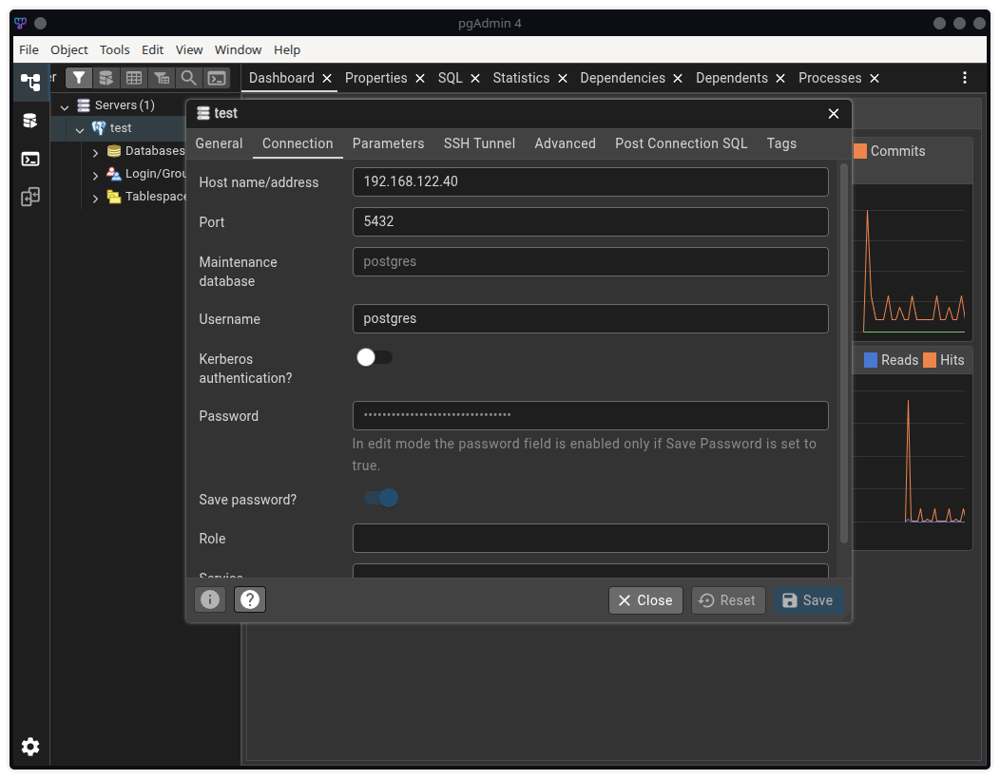
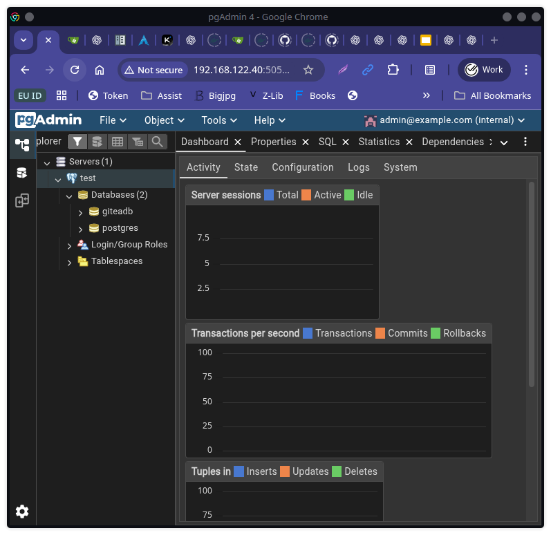
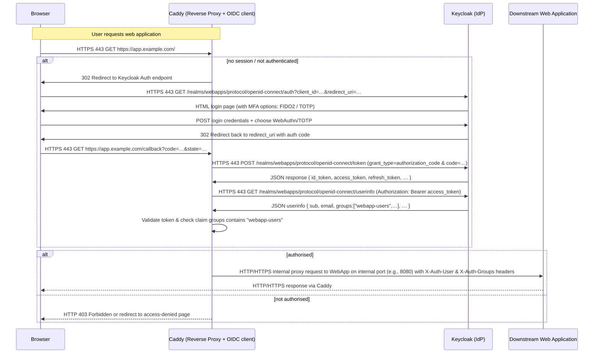
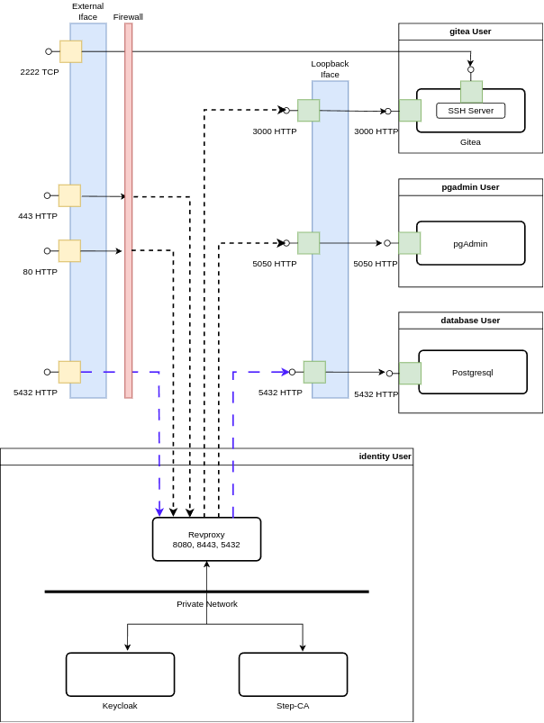

# Real World Example

This is a good point to consider a real world (concrete) example to solidify our understanding of the concepts covered so far.

In this lab we will explore a system of applications that use the same shared database while running a very dangerous application, the pgAdmin application used for PostgreSQL database management. We will demonstrate how to mitigate the inherent risks of pgAdmin in a containerized environment using Podman quadlets and systemd.

>**NOTICE** You can start this lab with work on the VM without having to perform the other labs first. It is not additive, all the commands will be independent. However, you may find it helpful to have done the previous labs to understand the concepts and commands used here.

## 0. Snapshot

Before proceeding, create a VM snapshot to allow easy rollback after completing this lab. You can create a snapshot with the following command on your host:

```bash
vagrant snapshot save example-start
```

## 1. pgAdmin

pgAdmin is a popular tool for managing PostgreSQL servers and databases. It provides a web-based interface for database administration tasks such as creating databases, running queries, managing users, and monitoring performance. It manages connection objects to PostgreSQL servers and databases, storing connection parameters and credentials (sometimes of database super users) within its own internal database. By its very nature it is an extremely dangerous application to host and to expose to users in networked environments.

>**WARNING**: Enterprise production environments should never use pgAdmin or similar database management applications. They are simply too risky to expose and they promote one-off manual changes to database servers outside of DevOps automation processes making database servers snowflake servers. Such tools are a security nightmare and should be avoided at all costs in almost all environments much less production environments. Non-production developer environments, and perhaps home lab environments for those just learning to us Postgresql, I understand, but still I recommend against it. It's a crutch, just start getting used to using SQL, DDL, and DevOps automation instead: the investment amortizes in the end and you won't instill bad habits in yourself.

### 1.1 Get triggered

Anytime you see an application that:

* exposes a web interfaces for management
* manages connections and credentials
* has access to super user credentials
* has the ability to run arbitrary commands
* is always on and accessible over the network

You should be immediately triggered to avoid using it at all costs. Such applications are a magnet for attackers and a security nightmare to manage. We're only toying with the idea as a challenging exercise to demonstrate how to mitigate the risks of such an application using Podman quadlets and systemd. Do not take this as an endorsement to use pgAdmin or similar classes of risky applications in your environments.

When you do get triggered, and you don't have a choice (because higher authorities insists on using such an application), then the protection patterns discussed here will help. In fact, these techniques are still recommended for any third party applications you cannot thoroughly assess the security implications of. They're best practices for securely hosting any third party applications in general.

### 1.2 pgAdmin Modes

The pgAdmin application has two modes: the web server application mode and the desktop application mode. In web server application mode it runs centrally as a web application on a server that many users can access and log into. In desktop application mode it runs locally on a user's machine as a desktop application connecting directly to databases. Both provide the same common user interface running the same code base.

At first glance, the desktop application seems more secure because it runs locally and does not expose an "always-on" web interface. In web application mode, the application is accessible over the network, which can introduce additional attack vectors. Theoretically, in desktop mode users open the locally installed application, use it for a while, then shut it down when done. However, the application may be left running unintentionally exposing it for long periods of time. Even when off, pgAdmin is still at risk residing on a less secure desktop.

The desktop installations may not be as rigorously maintained and updated as web applications, leading to potential vulnerabilities on the host if software patches are not up to date. Generally desktops are more susceptible to malware or unauthorized access especially when misconfigured. The more desktop installations, the more points of attack. A centralized server alleviates these concerns since it can be centrally updated, managed, and monitored. In desktop mode, database access for multiple databases by multiple users will be required from multiple hosts. This is yet another management and security problem in itself. So the original question of which mode is more secure is a lot more complicated than it first appeared.

As an exercise we will secure both modes of pgAdmin tool operation: as a desktop installed application and as a web application.

### 1.3 Setting up the pgAdmin and Gitea Web Applications

* **PostgreSQL**: [Site](https://www.postgresql.org/) [Docker](https://hub.docker.com/_/postgres)
* **pgAdmin**: [Site](https://www.pgadmin.org/) [Docker](https://hub.docker.com/r/dpage/pgadmin4)
* **gitea**: [Site](https://gitea.com/en-us/) [Docker](https://docker.gitea.com/gitea:1.25.1-rootless) [Rootless Guide](https://docs.gitea.com/installation/install-with-docker-rootless)

Let's first set up the pgAdmin web application and gitea which both will connect to a postgresql database all running in their own containers using a Podman quadlet for each. All containers will run on the same host but isolated from each other in separate unprivileged users accounts.

>**NOTE**: The gitea application is a great application to demonstrate multiple applications sharing accessing the same database, plus it needs special security considerations for it's API.

Let's begin with the PostgreSQL server which also runs in its own unprivileged user account called `postgresql`. pgAdmin and gitea web applications will connect to the PostgreSQL server over its systemd socket port on `localhost:5432`. Log into the virtual machine as the `vagrant` user and issue the following commands to create the PostgreSQL container quadlet and set up volumes with bro-volume and socket activation using bro-activator:

```shell
PG_USER=postgresql
sudo bro-user --remove "${PG_USER}"
sudo bro-user "${PG_USER}"
PG_HOME="$(getent passwd "${PG_USER}" | cut -f 6 -d ':')"
CONTAINERS_CONFIG="${PG_HOME}"/.config/containers/systemd/

sudo -iu "${PG_USER}" mkdir -p "${CONTAINERS_CONFIG}"
cat <<EOF | sudo -iu "${PG_USER}" tee "${CONTAINERS_CONFIG}"/postgresql.container
[Unit]
Description=PostgreSQL Container

[Container]
Image=docker.io/library/postgres:16
ContainerName=postgresql
Environment=POSTGRES_PASSWORD=password
Volume=${PG_HOME}/volumes/gitea-setup.sql:/docker-entrypoint-initdb.d/gitea-setup.sql
Network=none

[Service]
Restart=always
TimeoutStartSec=120
StartLimitBurst=5
RestartSec=10s

[Install]
WantedBy=default.target
EOF

sudo bro-volume --name postgresql-data      \
    --owner "${PG_USER}"                    \
    --container postgresql                  \
    --container-user internal:999           \
    --container-group internal:999          \
    --container-path /var/lib/postgresql/data

cat<<'EOSQL' | sudo -iu "${PG_USER}" tee "${PG_HOME}"/volumes/gitea-setup.sql
-- Create gitea database and user
CREATE ROLE gitea WITH LOGIN PASSWORD 'gitea';
CREATE DATABASE
    giteadb
WITH OWNER
    gitea
TEMPLATE
    template0
ENCODING
    UTF8 LC_COLLATE 'en_US.UTF-8' LC_CTYPE 'en_US.UTF-8';
EOSQL
sudo chmod 644 "${PG_HOME}"/volumes/gitea-setup.sql

sudo -iu "${PG_USER}" bro-activator         \
    --name postgresql                       \
    --external-port 0.0.0.0:5432            \
    --internal-port 127.0.0.1:5432

sudo -iu "${PG_USER}" systemctl --user daemon-reload
sudo -iu "${PG_USER}" systemctl             \
    --user enable --now postgresql-activator.socket

export PGPASSWORD=password
DB_IP="$(ip route | grep 'kernel scope link' | awk '{print $9}')"
# Test connections
psql -h "${DB_IP}" -p 5432 -U postgres -c '\l'
psql -h 127.0.0.1 -p 5432 -U postgres -c '\l'
psql "postgres://gitea@${DB_IP}/giteadb"
```

>**NOTE**: The PostgreSQL server may take a little while to initialize the database on the first run. If the `psql` commands fail, wait a minute and try again.

The bro-activator command above sets up socket activation for the PostgreSQL server container on `0.0.0.0:5432` for the host which means all interfaces including its loopback and external interface. The PostgreSQL server container is hence directly exposed to the network. Desktop pgAdmin instances can connect to it from outside the VM and the pgAdmin web application container will be able to connect to it over the loopback interface.

Now let's set up the pgAdmin web application container in its own unprivileged user account called `pgadmin`. The pgAdmin container will connect to the PostgreSQL server over its systemd socket port on `localhost:5432`. Issue the following commands:

```bash
PG_USER=pgadmin
sudo bro-user --remove "${PG_USER}"
sudo bro-user "${PG_USER}" \
    --network-cmd "none"
PG_HOME="$(getent passwd "${PG_USER}" | cut -f 6 -d ':')"
CONTAINERS_CONFIG="${PG_HOME}"/.config/containers/systemd/

sudo -iu "${PG_USER}" mkdir -p "${CONTAINERS_CONFIG}"
cat <<'EOF' | sudo -iu "${PG_USER}" tee "${CONTAINERS_CONFIG}"/pgadmin.container
[Unit]
Description=pgAdmin Container

[Container]
Image=docker.io/dpage/pgadmin4:latest
ContainerName=pgadmin
Environment=PGADMIN_DEFAULT_PASSWORD=password
Environment=PGADMIN_DEFAULT_EMAIL=admin@example.com
Environment=PGADMIN_LISTEN_PORT=5050

# Works like a charm too
#Network=slirp4netns:allow_host_loopback=true
#AddHost=postgresql:10.0.2.2

Network=pasta:-T,5432:5432,--map-gw,--ipv4-only
AddHost=postgresql:192.168.122.1

[Service]
Restart=always
TimeoutStartSec=120
StartLimitBurst=5
RestartSec=10s

[Install]
WantedBy=default.target
EOF

sudo bro-volume --owner "${PG_USER}"        \
    --remove --name pgadmin-data
sudo bro-volume --name pgadmin-data         \
    --owner "${PG_USER}"                    \
    --container pgadmin                     \
    --container-user internal:5050          \
    --container-group internal:0            \
    --container-path /var/lib/pgadmin

sudo -iu "${PG_USER}" bro-activator         \
    --name pgadmin                          \
    --external-port 5050                    \
    --internal-port 127.0.0.1:5050

sudo -iu "${PG_USER}" systemctl --user daemon-reload
sudo -iu "${PG_USER}" systemctl             \
    --user enable --now pgadmin-activator.socket
```

>**NOTE**: The upstream `dpage/pgadmin4` image runs as uid/gid 5050/0, so the `bro-volume --container-user/--container-group` flags accept usernames (like `pgadmin`), numeric IDs, or `internal:`-prefixed IDs. `internal:5050` maps pgAdmin's in-container UID to the correct subordinate UID on the host, and `internal:0` maps the container's root group back to the host pgadmin user. No hand-calculating `236121`.

Using `--container-group pgadmin` instead of `internal:0` produces the same permissions on the host because `bro-volume` resolves group names and translates internal:0 to the owner name before applying ownership changes to ZFS dataset mount points.

### 1.4 Connecting with pgAdmin Desktop and pgAdmin Web Application

Go ahead and download and install the pgAdmin desktop application on your host machine from the [pgAdmin website](https://www.pgadmin.org/download/). Once installed, launch the pgAdmin desktop application. Here's how my setup looks like on Manjaro Linux:


Notice it requests a master password to protect stored connection credentials. Set a strong master password and remember it. This helps protect stored connection credentials in case the desktop is compromised but it is not foolproof.

Let's connect to the PostgreSQL server running in the VM using the following connection parameters:

```text
Host: 192.168.122.40
Port: 5432
Username: postgres
Database: postgres
Password: password
```

>**NOTE**: the host IP address may vary depending on your VM setup. Adjust accordingly.



Once connected, you should see the PostgreSQL server and its databases in the pgAdmin desktop application. If so, configurations, you're now connected to the PostgreSQL server running in the VM from the desktop pgAdmin application.

You can also connect to the PostgreSQL server from within the pgAdmin web application running in its own container in the VM. Use the following settings instead in the web application after logging in with username `admin@example.com` and password `password` to setup a new server connection:

```text
Host: postgresql
Port: 5432
Username: postgres
Database: postgres
Password: password
```

Notice in this case we use the hostname `postgresql` which resolves to the PostgreSQL server container's IP address in the pgAdmin container's network namespace thanks to the `AddHost=` directive in the pgAdmin quadlet.

Both pgAdmin instances (desktop and web) are able to connect to the same PostgreSQL server instance running in its own container in the VM. In both cases a systemd socket is used to activate a Podman container and proxy traffic to PostgreSQL server in its own unprivileged user account.

### 1.5 Setting up Gitea

Let's set up another application that non-interactively uses the same shared PostgreSQL instance to demonstrate path based authentication with the reverse proxy later. We'll use Gitea, a lightweight code hosting solution written in Go. It supports Git version control and provides a web interface and rest API for managing repositories, users, and other features.

Create another unprivileged user account called `gitea` and set up the Gitea container in its own unprivileged user account. Issue the following commands:

```bash
GITEA_USER=gitea
sudo bro-user --remove "${GITEA_USER}"
sudo bro-user "${GITEA_USER}" --network-cmd "none"
GITEA_HOME="$(getent passwd "${GITEA_USER}" | cut -f 6 -d ':')"
CONTAINERS_CONFIG="${GITEA_HOME}"/.config/containers/systemd/
sudo -iu "${GITEA_USER}" mkdir -p "${CONTAINERS_CONFIG}"
cat <<'EOF' | sudo -iu "${GITEA_USER}" tee "${CONTAINERS_CONFIG}"/gitea.container
[Unit]
Description=Gitea Container

[Container]
Image=docker.gitea.com/gitea:1.25.1-rootless
ContainerName=gitea

Environment=GITEA__security__INSTALL_LOCK=true
Environment=GITEA__database__DB_TYPE=postgres
Environment=GITEA__database__HOST=postgresql:5432
Environment=GITEA__database__NAME=giteadb
Environment=GITEA__database__USER=gitea
Environment=GITEA__database__PASSWD=gitea

Network=pasta:-T,5432:5432,--map-gw,--ipv4-only
AddHost=postgresql:192.168.122.1

Volume=/etc/timezone:/etc/timezone:ro
Volume=/etc/localtime:/etc/localtime:ro

[Service]
Restart=always
TimeoutStartSec=120
StartLimitBurst=5
RestartSec=10s

[Install]
WantedBy=default.target
EOF

sudo bro-volume --owner "${GITEA_USER}"         \
    --remove --name gitea-data
sudo bro-volume --name gitea-data               \
    --owner "${GITEA_USER}"                     \
    --container gitea                           \
    --container-user internal:1000              \
    --container-group internal:1000             \
    --container-path /var/lib/gitea

sudo bro-volume --owner "${GITEA_USER}"         \
    --remove --name gitea-config
sudo bro-volume --name gitea-config             \
    --owner "${GITEA_USER}"                     \
    --container gitea                           \
    --container-user internal:1000              \
    --container-group internal:1000             \
    --container-path /etc/gitea

sudo -iu "${GITEA_USER}" bro-activator          \
    --name gitea                                \
    --service-name http                         \
    --external-port 0.0.0.0:3000                \
    --internal-port 127.0.0.1:3000

sudo -iu "${GITEA_USER}" bro-activator          \
    --name gitea                                \
    --service-name ssh                          \
    --external-port 0.0.0.0:2222                \
    --internal-port 127.0.0.1:2222

sudo -iu "${GITEA_USER}" systemctl --user daemon-reload
sudo -iu "${GITEA_USER}" systemctl              \
    --user enable --now                         \
        gitea-http-activator.socket             \
        gitea-ssh-activator.socket

sudo -iu "${GITEA_USER}" systemctl --user start gitea.service
sudo -iu "${GITEA_USER}" podman exec -it gitea  \
    /app/gitea/gitea admin user create          \
    --username admin                            \
    --password password                         \
    --email admin@example.com                   \
    --admin                                     \
    -c /etc/gitea/app.ini
```

>**TIP**: The `--service-name` flag scopes each activator to a distinct unit name (`gitea-http-activator.{socket,service}` and `gitea-ssh-activator.{socket,service}` in this example). Without it, the second activator would overwrite the first because they would both try to manage `gitea-activator.*`. Use descriptive labels like `http`, `ssh`, or `api` whenever you need to expose multiple ports for a single container.

Now on your desktop you can navigate to `http://<your-vm-ip>:3000/user/login` to log into the Gitea web application. Log in with username `admin` and password `password`. You should now have access to the Gitea web interface. You can create repositories, manage users, and explore its features.


Here's the Gitea web interface after logging in:


Gitea is connected to the same PostgreSQL server instance running in the VM, so in pgAdmin refresh the connection and you should see the `giteadb` database.



So far so good. Both pgAdmin (desktop and web) and Gitea are able to connect to the same PostgreSQL server instance running in its own container in the VM. However, the PostgreSQL server is directly exposed to the network which is not secure. pgAdmin web application is also directly exposed to the network which is also not secure as secure as we want it to be considering it stores connections to the PostgreSQL server including super user credentials.

Not so bad, but this is the insecure setup. Now let's discuss how to secure it.

## 2.0 Strong Authentication

We will use a class of techniques called strong authentication to secure access to dangerous applications such as pgAdmin. In fact, strong authentication is recommended for any exposed application. Strong authentication requires more than just a password to authenticate users. It typically involves multiple factors of authentication such as something you know (password), something you have (security token), or something you are (biometric verification).

### 2.1 Strong Authentication for Interactive Applications

There are directly exposed interactive end-user applications and indirectly exposed non-interactive backend services. Interactive end-user applications require user interaction to function, such as the pgAdmin web application. We can exploit that fact to force the use of strong authentication which requires user interaction: a token button press, a biometric verification, or a TOTP one time code. Using such mechanisms helps secure access to such dangerous applications. In fact, strong password-less authentication should be used everywhere regardless of the application.

Strong authentication mechanisms will be used to gate access to the application at the network level before an attacker can reach the application itself. This way, we generalize a reusable solution for any directly exposed end-user (interactive) application. Most web applications manage users and password credentials and many have integrations for strong authentication mechanisms such as MFA. However, we want to avoid the quagmire of application specific configuration details and coupling. We want one, ***decoupled and independent*** strong authentication approach that applies across all applications without having know anything about the application.

As discussed in the last section, we can use a reverse proxy to enforce authentication, then (perform authorization to) allow or deny access to the application before even reaching the application. The reverse proxy can be combined with an Identity Provider (IdP) to support multiple strong authentication mechanisms and manage groups authorized to access downstream applications.

>**IN APPLICATION API ACCESS**: Some interactive applications also expose APIs for automation and thus are both non-interactive and interactive. Since these APIs are non-interactive, they cannot leverage user interaction for strong authentication. Instead, they often rely on API-token based authentication mechanisms, OAuth tokens, or JWTs. Application APIs have distinct and different URL paths than those presented to interactive users. The reverse proxy can map different authentication mechanisms based on URL paths to support both interactive end-user paths with strong authentication and non-interactive APIs using API-token based authentication. We introduced gitea not only because we wanted yet another application using the database but it also has an API to demonstrate path based authentication with.

### 2.2 Caddy and Keycloak to the rescue

Caddy will be used for the reverse proxy. Keycloak will be used an Identity Provider (IdP). Step-ca will be used to issue TLS certificates. These three components will run in a single unprivileged user account called `identity`. The pgAdmin web application already runs in its container in its own unprivileged user account called `pgadmin`, and as a desktop client on test desktops. PostgreSQL already runs in its own container in its own unprivileged user account called `postgresql`. Gitea will be used as another test application that non-interactively uses the same shared postgresql instance and it will run in its own unprivileged user account called `gitea`.

Caddy will gate access and route traffic to the two web applications: pgAdmin and gitea. Caddy will use WebAuthn APIs for FIDO2 and TOTP strong authentication mechanisms to authenticate and authorize users using Keycloak as the IdP. Only authorized users in specific groups will be allowed access to each application. Caddy will also proxy Keycloak and step-ca endpoints for web applications to use. Here's a list of proxied endpoints:

* the Keycloak server web administration UI for user self-service and management and its WebAuthn endpoints
* the pgAdmin web application UI for postgresql database management
* the postgresql server for database connections from clients, for both interactive and non-interactive access
* the gitea application for non-interactive access to postgresql
* the step-ca ACME endpoint for certificate issuance and renewal
* the step-ca TLS client authentication endpoint



#### Overview of the flow

Users of an interactive web app → hit Caddy reverse-proxy → Caddy ensures they're authenticated (via Keycloak) and authorised (group membership) → if yes, proxy to downstream web application; if no, deny. Here's the typical step-by-step flow:

1. A user opens the browser and tries to access the web app through the Caddy proxy (e.g., <https://app.example.com>).

2. Caddy detects that the user is not yet authenticated (via some session cookie or token).

3. Caddy (or a plugin) sends the user to Keycloak for login (redirect). This uses the OIDC protocol (which is built on OAuth 2.0). Keycloak presents the login screen — and you can configure it to require FIDO2 / TOTP as part of the login flow (MFA).

4. User completes authentication (with FIDO2 key or TOTP). Keycloak issues an ID token and/or access token (JWT) to the browser/app.

5. Browser returns to Caddy (via the callback redirect) with the token or code, etc.

6. Caddy validates the token (or exchanges an authorization code for a token) and checks the user's group/role claims to decide if the user is allowed to access the downstream web-app.

    * If allowed: Caddy forwards the request to the downstream web application, possibly passing a header (e.g., Authorization: Bearer token or a custom header with user info).

    * If not allowed: Caddy returns 403 or redirects to an “access denied” page.

7. For subsequent requests, the session is maintained (cookie or token) so the redirect to Keycloak is not repeated until session expiry.

So, in short: Caddy acts as an OIDC client (or uses an OIDC gate/plug-in) in front of your web-app; Keycloak is the OIDC provider.

#### Unprivileged Users and Containers



In section [2.0 Strong Authentication](5. example.md#20-strong-authentication) mentioned the words, "decoupled" and "independent", with respect to the mechanism. What was meant now manifests concretely in the security contexts and boundaries in the diagram above. Notice that Caddy, Keycloak, and step-ca all run together in the same unprivileged user account called `identity` with a network quadlet to provide private container-to-container communication between them. They are tightly coupled to one another and together they provide strong authentication and authorization. However, they are decoupled and independent of the applications they gate access to: `pgAdmin` and `gitea`. These protected applications run in their own unprivileged user accounts called `pgadmin` and `gitea` respectively. There is no contagion risk between the identity services and the applications they protect.

Compromising the `identity` unprivileged user account running Caddy and Keycloak does not compromise the applications they provide an additional layer of strong authentication to protect. Caddy knows nothing about the applications themselves other than their existence and how to proxy them. Keycloak registers hardware tokens for users and groups them based on their access to applications. Together they determine and proxy connections to applications. The private network quadlet for container-to-container communication allows Caddy connections to Keycloak and step-ca to remain private over the dedicated network without risking exposure of their service ports to the host or to the outside world; namely:

  * Caddy's OIDC interactions with Keycloak to enforce policies and access to web applications at the network level
  * Caddy's proxying of Keycloak endpoints
  * Caddy's proxying of step-ca ACME and TLS client authentication endpoints

Identity operations are fully isolated from application operations and Caddy is the first decoupled protective barrier, an independent PEP (Policy Enforcement Point), controlling network level access to applications based on authentication and authorization policies. Applications still manage their own users requiring them to login to the applications themselves: these are second independent authentication factors, the "what you know" factors. Again, compromising the unprivileged `identity` user or any one of the other unprivileged applications (pgAdmin and gitea) does not compromise the other unprivileged user accounts or its containers. Everything remains intact and independent even though there are perceived dependencies: i.e. Caddy still proxies pgAdmin and gitea.

Furthermore, the pgAdmin and gitea containers running in their own separate unprivileged user accounts are never directly exposed to the network. These applications expose their HTTP ports on the host's loopback interface. Only the Caddy reverse proxy is directly exposed to proxy traffic outside of the host. Firewall rules in the host map privileged port 443 to Caddy's listening port 8443 since Caddy cannot bind to ports below 1024 when running unprivileged. Port 80 is always redirected by the firewall to port 443. Caddy also redirects port 8080 to 8443 to always ensure the use of TLS termination. The firewall may also be used to restrict access to Caddy from known IP sources and trusted networks.

### 2.3 Protecting pgAdmin Desktop Mode

There will be multiple desktop mode pgAdmin application instances running across external desktop hosts, a.k.a. clients. Each client requires access to postgresql servers over the network: the ones they administer. In our case we just have one shared postgresql server instance. The host's external interface binds port 5432 for postgresql connections originating from desktop pgAdmin clients. Instead of exposing the postgresql server directly to clients, the same Caddy reverse proxy also handles postgresql server connections from desktop pgAdmin clients. The reverse proxy should also serve as a PEP before allowing access to the database: no network access granted unless authenticated and authorized.

So what options do we have? How can we do this with a generalized (reusable) solution?

Although the latest postgresql 18.0 release now supports OAuth 2.0 with bearer tokens for database connections, pgAdmin desktop mode does not support OAuth 2.0 or OpenID Connect (OIDC) for database connections. Therefore, we cannot use the same OIDC based strong authentication mechanism used for web applications to secure database connections from desktop pgAdmin clients. The industry, not just the pgAdmin people, are getting there though, so keep an eye out for better integration options; OIDC is the better way to go.

#### SSH Tunneling or TLS Client Certificates?

That said, two common denominator alternatives remain: they're both equal in terms of their strength and management overheads. One is the use of TLS client certificates for strong authentication, and the other is the use of SSH tunneling with SSH keys. Both are generalized and can be used beyond our specific use case of gating postgresql network access. Let's quickly analyze both approaches.

Both require key material on the client: TLS client certificate private key or SSH private key. Both need to be generated, trusted (configured), and protected. Both can be compromised on the client side unless protected by a token or a vault via token access API's such as PKCS#11. Both are equally strong when implemented properly.

**WARNING**: Storing private keys on clients is always too great a risk: if the client is compromised, the private key can be stolen and used to impersonate the client, so don't do it unless you can protect client keys using a hardware security token.

TLS is a baked in standard for securing network communications. It operates at layer 4 of the OSI model, providing end-to-end encryption and authentication. TLS client certificates are widely supported by many applications and services, including postgresql. They're also supported by multiple hardware tokens and interfaces for proper protection on client systems. They can be easily integrated into existing infrastructure and provide a seamless user experience. It's a first class citizen of the network stack.

SSH on the other hand is primarily designed for secure remote access and command execution. While SSH tunneling can be used to secure database connections, it introduces additional complexity and overhead. SSH requires managing separate user accounts and their keys, and this is what increases exposure and complexity (more moving parts). Additionally, not all applications natively support SSH tunneling, requiring additional configuration and more one offs. Let's play it safe and stick to the official standard. SSH keys do not work well with hardware tokens either, often requiring both gpg/tls certs and SSH keys representing them to be generated: it's still a problem but may improve later.

#### Using TLS Client Certificates

Caddy will be configured to use TLS certificates trusted by the step-ca certificate authority (CA) for client authentication. This way, all traffic between pgAdmin desktop clients and Caddy is encrypted and TLS authenticated in both directions. To do so, Caddy exposes a separate connection path from outside of the host to the postgresql server.

>I'm so tempted to try Postgresql 18.0 which was just released support for OAuth 2.0 with bearer tokens. PostgreSQL 18.0 can be configured for external (non-loopback) database connection sources to switch authentication mechanisms and act as an OIDC client to Keycloak. Keycloak can enable short lived or one time use API tokens for DevOps automation. It would be wonderful to tie and track one time authorizations to DevOps jobs that modify databases in security logs. But I digress.

Even if a desktop pgAdmin installation is compromised, the attacker cannot access the postgresql server without the client certificate. Securing the client certificate private key on the desktop is still paramount.

>We will **NOT** rely on IP sources since in dynamic environments (clients using DHCP) these change, and can easily be spoofed. Relying on IP sources make the system much more brittle in the long run and is not a solid security measure unless "LAN authentication/authorization" 802.1X or a VPN gateway is used: essentially some way to authenticate and authorize IP addresses on the network.

## 3.0 Building out the identity User Account

We're going install Caddy, Keycloak, and step-ca in their own unprivileged user account called `identity`. The three components will run in containers managed by Podman quadlets. They will communicate over a private network quadlet only accessible to them. For more details on the containers involved see the following sites and docker hub pages:

* **Caddy**: [Site](https://caddyserver.com/) [Docker](https://hub.docker.com/_/caddy)
* **Keycloak**: [Site](https://www.keycloak.org/) [Docker](https://hub.docker.com/r/keycloak/keycloak) [Getting Started Podman](https://www.keycloak.org/getting-started/getting-started-podman)
* **step-ca**: [Site](https://smallstep.com/docs/step-ca/) [Docker](https://hub.docker.com/r/smallstep/step-ca)

Let's begin by creating the `identity` unprivileged user account and the `idp-private` network quadlet while logged into virtual machine as the vagrant user:

```bash
ID_USER=identity
sudo bro-user --remove "${ID_USER}"
sudo bro-user "${ID_USER}" --network-cmd "none"
ID_HOME="$(getent passwd "${ID_USER}" | cut -f 6 -d ':')"
CONTAINERS_CONFIG="${ID_HOME}"/.config/containers/systemd/
sudo -iu "${ID_USER}" mkdir -p "${CONTAINERS_CONFIG}"

cat <<'EOF' | sudo -iu "${ID_USER}" tee "${CONTAINERS_CONFIG}"/idp-private.network
[Unit]
Description=Internal IDP Network Quadlet
After=network-online.target

[Network]
NetworkName=idp-private
Subnet=192.168.200.0/24
Gateway=192.168.200.1
DNS=192.168.200.1

[Install]
WantedBy=default.target
EOF

sudo -iu "${ID_USER}" systemctl --user daemon-reload
sudo -iu "${ID_USER}" systemctl --user start idp-private-network.service
sudo -iu "${ID_USER}" systemctl --user status idp-private-network.service -l --no-pager
sudo -iu "${ID_USER}" podman network list

# Without NetworkName would be systemd-idp-private
sudo -iu "${ID_USER}" podman network inspect idp-private
```

Now let's start adding containers one at a time to the new `idp-private` network quadlet.

### 3.1 Add Caddy to the idp-private Network

Create the Caddy quadlet and add it to the `idp-private` network quadlet:

```shell
ID_USER=identity
ID_HOME="$(getent passwd "${ID_USER}" | cut -f 6 -d ':')"
CONTAINERS_CONFIG="${ID_HOME}"/.config/containers/systemd/
cat <<'EOF' | sudo -iu "${ID_USER}" tee "${CONTAINERS_CONFIG}"/caddy.container
[Unit]
Description=Caddy Container

[Container]
Image=docker.io/caddy:latest
ContainerName=caddy
Volume=/etc/timezone:/etc/timezone:ro
Volume=/etc/localtime:/etc/localtime:ro
Network=idp-private
IP=192.168.200.10
DNSSearch=brothaman.org
AddHost=caddy.brothaman.org:192.168.200.10
AddHost=keycloak.brothaman.org:192.168.200.20
AddHost=step-ca.brothaman.org:192.168.200.30

[Service]
Restart=always
TimeoutStartSec=120
StartLimitBurst=5
RestartSec=10s

[Install]
WantedBy=default.target
EOF

sudo bro-volume --owner "${ID_USER}"            \
    --remove --name caddy-data
sudo bro-volume --name caddy-data               \
    --owner "${ID_USER}"                        \
    --container caddy                           \
    --container-user internal:1000              \
    --container-group internal:1000             \
    --container-path /data

sudo bro-volume --owner "${ID_USER}"            \
    --remove --name caddy-config
sudo bro-volume --name caddy-config             \
    --owner "${ID_USER}"                        \
    --container caddy                           \
    --container-user internal:1000              \
    --container-group internal:1000             \
    --container-path /config

sudo bro-volume --owner "${ID_USER}"            \
    --remove --name caddy-etc
sudo bro-volume --name caddy-etc                \
    --owner "${ID_USER}"                        \
    --container caddy                           \
    --container-user internal:1000              \
    --container-group internal:1000             \
    --container-path /etc/caddy

cat <<'EOF' | sudo -iu "${ID_USER}" tee "${ID_HOME}"/volumes/caddy-etc/Caddyfile
{
    http_port 80
    https_port 443

    # Global options block
    email admin@identity.brothaman.org
}

identity.brothaman.org {
    # For now just return a simple page
    tls internal
    respond <<EOHTML
Hello from Caddy over HTTPS

EOHTML
}
EOF

sudo -iu "${ID_USER}" bro-activator --remove    \
    --name caddy --service-name http
sudo -iu "${ID_USER}" bro-activator             \
    --name caddy                                \
    --service-name http                         \
    --external-port 0.0.0.0:8080                \
    --internal-port 127.0.0.1:80

sudo -iu "${ID_USER}" bro-activator --remove    \
    --name caddy --service-name https
sudo -iu "${ID_USER}" bro-activator             \
    --name caddy                                \
    --service-name https                        \
    --external-port 0.0.0.0:8443                \
    --internal-port 127.0.0.1:443

sudo -iu "${ID_USER}" systemctl --user daemon-reload
sudo -iu "${ID_USER}" systemctl --user enable   \
    --now caddy-http-activator.socket
sudo -iu "${ID_USER}" systemctl --user enable   \
    --now caddy-https-activator.socket
```

The Caddy container image by default runs the Caddy process privileged within it so it can bind to ports below 1024. However, since we're running the container unprivileged in Podman, the activator proxy cannot bind to privileged ports. Therefore, we configure the activator sockets to listen on unprivileged ports 8080 and 8443 on all the host's interfaces and map them to Caddy's internal listening ports 80 and 443 respectively.

Later we will add firewall rules to the VM as root to map privileged ports 80 and 443 to the unprivileged ports 8080 and 8443 respectively. This seems a bit roundabout: Caddy inside the container binds to 80 and 443, the activator proxies bind to 8080 and 8443 on the host, and eventually as you will see firewall rules we will add to the vm will maps 80 and 443 to 8080 and 8443 on the host. Yes, this feels like we're scratching the left year with our right hand but it's the only way to get around the privileged port binding restriction when running unprivileged containers. The same would occur using the PublishPort directive in Docker/Podman.

#### Verify idp-private Network Gateway Connectivity

Now after putting the first container into the new idp-private network you should be able to ping the gateway and see the network interfaces from within the unprivileged user's podman unshare rootless network namespace. Try this as the `vagrant` user:

```shell
sudo -iu "${ID_USER}" podman unshare --rootless-netns ip addr show
sudo -iu "${ID_USER}" podman unshare --rootless-netns /usr/sbin/brctl show

if sudo -iu "${ID_USER}" podman unshare --rootless-netns ping -W 0.5 -c 1 192.168.200.1 > /dev/null; then
    echo "Ping to gateway 192.168.200.1 successful"
else
    echo "Ping to gateway 192.168.200.1 failed"
fi
```

#### Verify Caddy Access via Activator Sockets

Let's also verify that Caddy can be accessed via its activator sockets:

```shell
ip=$(ip -o -4 addr show "$(ip route show default | awk '/default/ {print $5}')" | awk '{split($4,a,"/"); print a[1]; exit}')
echo "$ip identity.brothaman.org" # | sudo tee -a /etc/hosts
curl -k --resolve identity.brothaman.org:8443:${ip} https://identity.brothaman.org:8443
curl -v --resolve identity.brothaman.org:8080:${ip} http://identity.brothaman.org:8080
```

Notice the commands in the snippet above use curl's `--resolve` flag to override DNS resolution for the test. We grab the interface from the default rote, extract its ipv4 address, and use that to resolve the hostname to the correct IP address. You can also add an entry to your desktop's `/etc/hosts` file for easier access. Just uncomment the pipe at the end of the echo line in the snippet above.

Also notice the use of the `-k` flag in the first curl line to skip TLS certificate verification since Caddy is using a self-signed internal CA certificate for TLS termination. Try removing it and you'll see this output:

```shell
vagrant@debian12:~$ curl --resolve identity.brothaman.org:8443:${ip} https://identity.brothaman.org:8443
curl: (60) SSL certificate problem: unable to get local issuer certificate
More details here: https://curl.se/docs/sslcerts.html

curl failed to verify the legitimacy of the server and therefore could not
establish a secure connection to it. To learn more about this situation and
how to fix it, please visit the web page mentioned above.
```

The certificate verification fails because the self-signed internal CA certificate is not trusted by default. You can add the CA certificate to your desktop's trusted certificate store to fix this.

Also notice the output of the second command:

```shell
vagrant@debian12:~$ curl -v --resolve identity.brothaman.org:8080:${ip} http://identity.brothaman.org:8080
* Added identity.brothaman.org:8080:192.168.122.40 to DNS cache
* Hostname identity.brothaman.org was found in DNS cache
*   Trying 192.168.122.40:8080...
* Connected to identity.brothaman.org (192.168.122.40) port 8080 (#0)
> GET / HTTP/1.1
> Host: identity.brothaman.org:8080
> User-Agent: curl/7.88.1
> Accept: */*
>
```

If you ran this without the `-v` flag curl wouldn't print the extra verbose output because it completed successfully with a redirect HTTP code 308 returned by Caddy. The client, curl, is told to go to port 443 for HTTPS. You can see this by swapping the `-v` with `-L` flag to curl to follow redirects:

```shell
vagrant@debian12:~$ curl -L --resolve identity.brothaman.org:8080:${ip} http://identity.brothaman.org:8080
curl: (7) Failed to connect to identity.brothaman.org port 443 after 1 ms: Couldn't connect to server
```

So the redirected request fails because port 443 is not open on the host. This is expected since we have not yet configured firewall rules to map privileged port 443 to Caddy's listening port 8443. We'll do that next.

### 3.2 Configure CA Trust and Firewall Rules

Time for some finishing touches. We will setup firewall rules in the VM to map privileged ports 80 and 443 to Caddy's unprivileged listening ports 8080 and 8443 respectively. We will also extract Caddy's internal CA certificate and add it to the VM host's trusted certificate store so that clients can trust certificates issued by step-ca.

#### Configure Firewall Rules

Now let's configure firewall rules to map privileged ports 80 and 443 to Caddy's activator listening ports 8080 and 8443 respectively. Run the following commands as the `vagrant` user:

```shell
cat <<'EOF' | sudo tee -a /etc/nftables.conf

# Caddy HTTP and HTTPS privileged to unprivileged port forwarding
table ip nat {
    chain prerouting {
        type nat hook prerouting priority -100;
        tcp dport 80  redirect to :8080
        tcp dport 443 redirect to :8443
    }

    chain output {
        type nat hook output priority -100;
        tcp dport 80  redirect to :8080
        tcp dport 443 redirect to :8443
    }

    chain postrouting {
        type nat hook postrouting priority 100;
    }
}
EOF

sudo nft -f /etc/nftables.conf
sudo nft list ruleset
```

The first prerouting chain handles incoming connections from external sources. The output chain handles locally generated connections from the host itself. The postrouting chain is empty for now but could be used later for source NAT if needed. So far so good. Now let's verify that Caddy is accessible via the standard privileged ports 80 and 443:

```shell
# First hitting HTTP on port 8080 redirected but internally with output chain to HTTPS on port 443
curl -v -k -L --resolve identity.brothaman.org:8080:${ip} http://identity.brothaman.org:8080

# Directly hit HTTPS 443 with no HTTP redirect needed but 443 -> 8443 thanks to prerouting chain
curl -v -k --resolve identity.brothaman.org:443:${ip} https://identity.brothaman.org

# First hits HTTP 80 and redirected to 443 -> 8443 but internally by output chain to HTTPS on port 443
curl -v -k -L --resolve identity.brothaman.org:443:${ip} http://identity.brothaman.org
```

From outside you can hit it like so as long as you set that `${ip}` variable to your VM's external IP address:

```shell
# ip=<your-vm-ip-address>
curl -v -k -L   --resolve identity.brothaman.org:80:${ip}   \
                --resolve identity.brothaman.org:443:${ip}  \
                http://identity.brothaman.org

curl -v -k --resolve identity.brothaman.org:443:${ip}       \
                https://identity.brothaman.org
```

#### Extract and Trust Caddy's Internal CA Certificate

Now let's extract Caddy's internal CA certificate and add it to the VM host's trusted certificate store so that clients can trust certificates issued by Caddy. While at it we will also add `identity.brothaman.org` to the `/etc/hosts` file. Run the following commands as the `vagrant` user:

```shell
sudo -iu "${ID_USER}" ls -l "${ID_HOME}"/volumes/caddy-data/caddy/pki/authorities/local/
sudo -iu "${ID_USER}" cp "${ID_HOME}"/volumes/caddy-data/caddy/pki/authorities/local/root.crt /usr/local/share/ca-certificates/caddy-internal.crt
sudo update-ca-certificates

if grep -q "identity.brothaman.org" /etc/hosts; then
    echo "Entry for identity.brothaman.org already exists in /etc/hosts"
else
    echo "Adding entry for identity.brothaman.org to /etc/hosts"
    ip=$(ip -o -4 addr show "$(ip route show default | awk '/default/ {print $5}')" | awk '{split($4,a,"/"); print a[1]; exit}')
    echo "${ip} identity.brothaman.org" | sudo tee -a /etc/hosts
fi
```

The `-k` flag is no longer needed when accessing Caddy since the CA certificate is now trusted. Furthermore the `/etc/hosts` entry allows easy access without needing to use curl's `--resolve` flag:

```shell
curl -L http://identity.brothaman.org
curl https://identity.brothaman.org
```

The HTTP request will be redirected to HTTPS automatically by Caddy so we still need curl's `-L` flag to follow redirects. Besides that everything else inside the VM works seamlessly with the least amount of flags. Browsers as well as curl will now also trust certificates issued by Caddy's internal CA. You can do the same for client desktop systems by adding the CA certificate to their trusted certificate stores.

#### Security Considerations

You just saw us copy Caddy's internal CA certificate's public key out of its container volume to the VM host's trusted certificate store. We also mentioned that it can be copied to other clients to trust Caddy proxied servers. Is this safe? Yes it is.

The caddy-root.crt file extracted above is the public CA certificate only. The private key remains securely stored inside the Caddy container volume and is not exposed. Only the public CA certificate is needed to establish trust. By itself the public key can't be used to sign anything; an attacker would also need the matching private key (`root.key` inside /data/caddy/pki/…). That private key stays on the Caddy host, and that's what must be protected like any other CA key.

However, you did see the private key there in the caddy-data volume right? Yes, but only because you have access to the host system as root. An attacker who compromises the host as root can always extract the private key from the container volume. Therefore, protecting the host system is paramount. If an attacker has root access to the host, all bets are off anyway.

#### Certificate Mitigations

You can further mitigate the risk of private key compromise by using step-ca to issue short lived intermediate certificates for Caddy instead of using its internal CA. You can configure step-ca to issue intermediate certificates with short lifetimes (e.g., hours or days) to Caddy for TLS termination. step-ca also provides all the infrastructure to automate certificate public key rotation and renewal.

* **Separation of duties**: Caddy no longer holds the root/intermediate private keys. Step-ca issues the certs; Caddy just requests them. Compromising the reverse proxy doesn't compromise the CA.

* **Central revocation/rotation**: step-ca maintains cert inventory and CRLs/OCSP. You can revoke a cert or intermediate, rotate keys on a schedule, and push new trust anchors out via config management. With Caddy's internal CA you'd have to manually copy/replace files and there's no revocation story.

* **Delegation and policy**: step-ca can issue different intermediates for different purposes (e.g., one for Caddy, one for other services), enforce lifetimes, require client auth, or integrate ACME endpoints for automation. Caddy can point its acme_server at step-ca so issuance still feels automatic but you keep control.

* **Client trust management**: If clients already trust your org's CA hierarchy (via step-ca), Caddy gets its certs from that chain and users don't need to install yet another root. If something goes wrong you invalidate the affected intermediates centrally, instead of touching every Caddy host.

This way even if Caddy's private root key is compromised the damage is limited to the certificate's short lifetime. You can also implement key rotation policies to periodically change the private key and re-issue certificates. This further limits the window of opportunity for an attacker.

So yes: letting step-ca be the authority and Caddy just an ACME/renewal client gives you revocation, auditing, centralized policy, and confines the CA keys to one place. It's the usual “don't mix your application and CA roles” benefit.

#### Additional Security Considerations

This all sounds good but both Caddy and step-ca containers co-located in the same unprivileged identity user account makes these suggestions seem somewhat moot. If the root or identity accounts are compromised, both containers are compromised. Plus, if I compromise Caddy's private key, I can spoof proxied applications without access to the step-ca root key.

So if you want to go robust, run step-ca in its own unprivileged user account separate from Caddy. This way compromising Caddy does not compromise step-ca, You might even want step-ca running on a separate ultra hardened host dedicated only to step-ca altogether. This adds complexity and management overhead but increases security. However, for many home lab use cases running both Caddy and step-ca in the same unprivileged user account is acceptable.

Another option is to protect step-ca's private key using hardware security modules (HSMs), TPMs or secure enclaves that provide an additional layer of security. This way even if the host is compromised, the private key remains protected within the HSM, TPM, or enclave. The applications proxied by Caddy can only be spoofed for a brief period of time (until the next rotation) if an attacker compromises Caddy's private key. Furthermore, if step-ca is using a hardware-backed key, the attacker cannot issue new certificates without access to the hardware module.

TPMs are ubiquitous in modern hardware and provide a cost effective way to protect private keys. They are widely supported by operating systems and software, including Smallstep's step-ca.

Step-ca can use a TPM-backed key for its root or intermediate CA. On Linux you can point step-ca at a PKCS#11 provider for the TPM (e.g., pkcs11uri pointing to the key handle) and configure the CA with that signer, or use Smallstep's experimental TPM engine to store the key in the TPM and have step-ca use it at startup. The net effect is the same: the private key never leaves the TPM, giving you hardware-backed protection for your CA root. Smallstep's docs cover both PKCS#11 and TPM drivers if you want to wire it up.

Here are the most helpful references for TPM-backed roots with Smallstep:

* Smallstep Docs - [TPM Attestation & Keys](https://smallstep.com/docs/step-ca/configuration/#tpm-and-pkcs11) (covers configuring step-ca with TPM-backed private keys and attestation)
* step-ca + [PKCS#11 guide](https://smallstep.com/docs/tutorials/hsm-pkcs11/) (how to point step-ca at a hardware-backed key, including TPM modules)
* [TPM integration announcement](https://smallstep.com/blog/tpm-support-step-ca/) (overview of TPM support in Smallstep, with examples)
* [Using a TPM to protect your CA keys](https://smallstep.com/blog/using-tpm-to-protect-ca-keys/) (detailed walkthrough of using TPMs with step-ca)

Those walk through generating a key inside the TPM, referencing it via PKCS#11 in ca.json, and the trade-offs between storing the root vs. an intermediate in hardware.

<!--
Another good utility to manage firewall rules for quadlet managed containers is `bro-firewall`. Here's how to use it to add and remove rules for Caddy:
sudo bro-firewall --name caddy
sudo bro-firewall --name caddy --remove
-->

### 3.3 Add the step-ca quadlet to the idp-private Network

Add the step-ca quadlet and add it to the `idp-private` network quadlet:

```shell
ID_USER=identity
ID_HOME="$(getent passwd "${ID_USER}" | cut -f 6 -d ':')"
CONTAINERS_CONFIG="${ID_HOME}"/.config/containers/systemd/
cat <<'EOF' | sudo -iu "${ID_USER}" tee "${CONTAINERS_CONFIG}"/step-ca.container
[Unit]
Description=Step-CA Container

[Container]
Image=docker.io/smallstep/step-ca:latest
ContainerName=step-ca

Environment=DOCKER_STEPCA_INIT_NAME=Smallstep
Environment=DOCKER_STEPCA_INIT_DNS_NAMES=localhost,brothaman.org
Environment=DOCKER_STEPCA_INIT_REMOTE_MANAGEMENT=true

Environment=DOCKER_STEPCA_INIT_REMOTE_MANAGEMENT=true
Environment=DOCKER_STEPCA_INIT_PROVISIONER_TYPE=admin
Environment=DOCKER_STEPCA_INIT_SSH=true
Environment=DOCKER_STEPCA_INIT_ACME=true
# Environment=DOCKER_STEPCA_INIT_PASSWORD_FILE=/run/secrets/stepca_password
Environment=DOCKER_STEPCA_INIT_PASSWORD=password

Volume=/etc/timezone:/etc/timezone:ro
Volume=/etc/localtime:/etc/localtime:ro

Network=idp-private
DNSSearch=brothaman.org
IP=192.168.200.30
AddHost=caddy.brothaman.org:192.168.200.10
AddHost=keycloak.brothaman.org:192.168.200.20
AddHost=step-ca.brothaman.org:192.168.200.30

[Service]
Restart=always
TimeoutStartSec=120
StartLimitBurst=5
RestartSec=10s

[Install]
WantedBy=default.target
EOF

sudo -iu "${ID_USER}" bro-activator             \
    --name step-ca                              \
    --service-name http                         \
    --external-port 0.0.0.0:9000                \
    --internal-port 127.0.0.1:9000

sudo -iu "${ID_USER}" systemctl --user daemon-reload
sudo -iu "${ID_USER}" systemctl --user start step-ca-http-activator.service
```

### 3.4 Add the Keycloak quadlet to the idp-private Network

Add the Keycloak quadlet and add it to the `idp-private` network quadlet:

```shell
cat <<'EOF' | sudo -iu "${ID_USER}" tee "${CONTAINERS_CONFIG}"/keycloak.container
[Unit]
Description=Keycloak Container

[Container]
#Image=quay.io/keycloak/keycloak:26.4.5
Image=keycloak/keycloak:26.4
ContainerName=keycloak
Exec=start-dev
Volume=/etc/timezone:/etc/timezone:ro
Volume=/etc/localtime:/etc/localtime:ro
IP=192.168.200.20
DNSSearch=brothaman.org
AddHost=caddy.brothaman.org:192.168.200.10
AddHost=keycloak.brothaman.org:192.168.200.20
AddHost=step-ca.brothaman.org:192.168.200.30
Network=idp-private

[Service]
Environment=KC_BOOTSTRAP_ADMIN_USERNAME=admin
Environment=KC_BOOTSTRAP_ADMIN_PASSWORD=password
Restart=always
TimeoutStartSec=120
StartLimitBurst=5
RestartSec=10s

[Install]
WantedBy=default.target
EOF

sudo -iu "${ID_USER}" bro-activator             \
    --name keycloak                             \
    --service-name http                         \
    --external-port 0.0.0.0:8081                \
    --internal-port 127.0.0.1:8080

sudo -iu "${ID_USER}" systemctl --user daemon-reload
sudo -iu "${ID_USER}" systemctl --user start keycloak-http-activator.socket
```

### 3.3 Verify Container-to-Container Communication

PID=$(podman inspect -f '{{.State.Pid}}' keycloak)
podman unshare nsenter --target $PID --uts --ipc --net --pid hostname -f
podman unshare nsenter --target $PID --uts --ipc --net --pid /usr/bin/ping -c1 192.168.200.1
